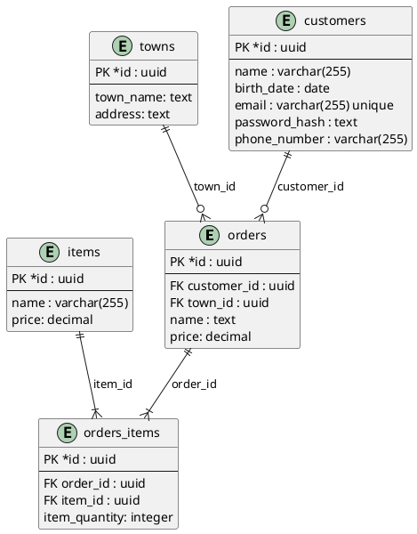
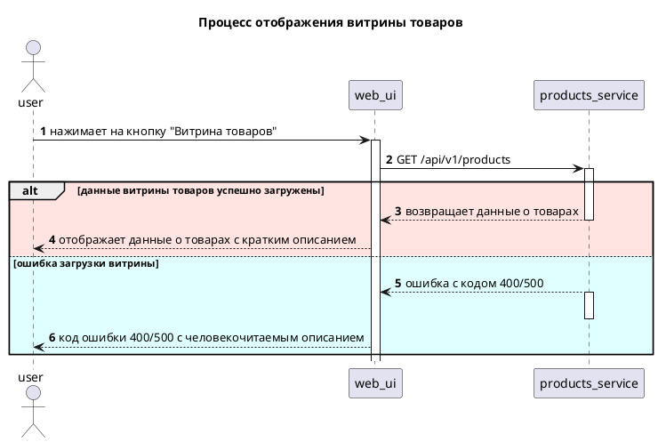
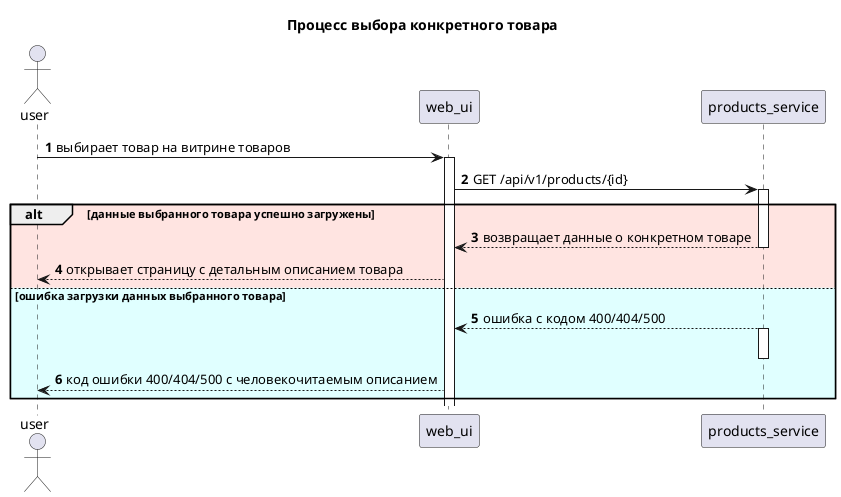
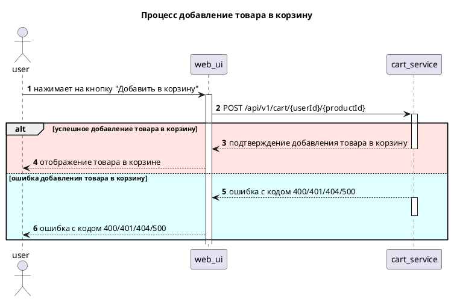

# Тестовое задание

## Базы данных тест

| №  | Ответ                                                                                                                                                                                                                                   |
|----|-----------------------------------------------------------------------------------------------------------------------------------------------------------------------------------------------------------------------------------------|
| 1  | 1. Содержит информацию о структуре БД                                                                                                                                                                                                   |
| 2  | 4. Неоднородная информация (данные разных типов)                                                                                                                                                                                        |
| 3  | 2. Значения первичного ключа всегда должны быть уникальными и не могут быть null, значения внешнего ключа могут повторяться<br>4. Первичный ключ является идентификатором для строки, а внешний ключ используется для связывания таблиц |
| 4  | 2. 2НФ                                                                                                                                                                                                                                  |
| 5  | 4. Сначала FROM, потом GROUP BY и только потом SELECT                                                                                                                                                                                   |
| 6  | 2. Оператор HAVING применяется для фильтрации групп, а WHERE - для фильтрации отдельных строк<br>3. HAVING работает только с агрегатными функциями, а WHERE может работать с любыми типами выражений                                    |
| 7  | 1. Число строк таблицы, указанной во FROM, не включая значение<br>3. Число строк таблицы, указанной во FROM, включая значение                                                                                                           |
| 8  | 1. SELECT age FROM Animals WHERE Animal LIKE “%fox”                                                                                                                                                                                     |
| 9  | 2. DELETE используется для удаления одной или нескольких строк из таблицы, а TRUNCATE используется для удаления всех строк из таблицы<br>3. DELETE может использовать условие WHERE, а TRUNCATE всегда удаляет все записи из таблицы    |
| 10 | 4. 2                                                                                                                                                                                                                                    |

## Базы данных ER



## Интеграции

### OpenAPI спецификация:

```yaml
openapi: 3.0.0
info:
  title: Интернет-магазин
  description: API интернет-магазина предназначен для отображения витрины товаров, перехода с витрины на экран с детальным описанием конкретного товара, добавления товара в корзину.
  version: 2.8.0
servers:
  - url: "https://api.shop.ru/api/v1"
    description: "Основной сервер"
paths:
  /products:
    get:
      summary: "Метод получения списка товаров"
      tags:
        - Products
      operationId: getAllProducts
      description: "Получение всего списка товаров"
      responses:
        '200':
          description: "Успешный ответ со списком товаров"
          content:
            application/json:
              schema:
                $ref: "#/components/schemas/ProductsList"
        '400':
          description: "Неправильный, некорректный запрос"
          content:
            application/json:
              schema:
                $ref: "#/components/schemas/Error400"
        "500":
          description: "Внутренняя ошибка сервера"
          content:
            application/json:
              schema:
                $ref: "#/components/schemas/Error500"
  /products/{id}:
    get:
      summary: "Метод получения товара по идентификатору"
      tags:
        - Product
      operationId: getProductById
      description: "Получение определённого товара по идентификатору"
      parameters:
        - name: id
          in: path
          required: true
          description: "Идентификатор товара"
          schema:
            type: string
      responses:
        '200':
          description: "Успешный ответ с одним товаром"
          content:
            application/json:
              schema:
                $ref: "#/components/schemas/Product"
        '400':
          description: "Неправильный, некорректный запрос"
          content:
            application/json:
              schema:
                $ref: "#/components/schemas/Error400"
        '404':
          description: "Товар с таким идентификатором не найден"
          content:
            application/json:
              schema:
                $ref: "#/components/schemas/Error404"
        "500":
          description: "Внутренняя ошибка сервера"
          content:
            application/json:
              schema:
                $ref: "#/components/schemas/Error500"
  /cart/{userId}/{productId}:
    post:
      summary: "Метод добавления товара в корзину"
      tags:
        - Cart
      operationId: createProductInCart
      description: "Добавление товара в корзину"
      requestBody:
        required: true
        content:
          application/json:
            schema:
              $ref: "#/components/schemas/CartProduct"
      responses:
        '200':
          description: "Успешный ответ с созданным товаром"
          content:
            application/json:
              schema:
                $ref: "#/components/schemas/CartProduct"
        '400':
          description: "Неправильный, некорректный запрос"
          content:
            application/json:
              schema:
                $ref: "#/components/schemas/Error400"
        '401':
          description: 'Пользователь не зарегистрирован и/или не авторизован в системе'
          content:
            application/json:
              schema:
                $ref: "#/components/schemas/Error401"
        '404':
          description: "Товар с таким идентификатором не найден"
          content:
            application/json:
              schema:
                $ref: "#/components/schemas/Error404"
        "500":
          description: "Внутренняя ошибка сервера"
          content:
            application/json:
              schema:
                $ref: "#/components/schemas/Error500"
components:
  schemas:
    Products:
      type: object
      required:
        - name
        - category
        - short_description
        - price
        - currency
        - photo
      properties:
        id:
          type: string
          format: uuid
          example: 33bcb3a0-f595-4437-9926-7b55d40e0847
          description: Уникальный идентификатор товара
        name:
          type: string
          example: 'Пижама'
          description: "Наименование товара"
        category:
          type: string
          example: 'Одежда для дома'
          description: "Категория товара"
        short_description:
          type: string
          example: 'Пижама из фланели, теплая и мягкая для зимы'
          description: "Краткое описание товара"
        price:
          type: number
          example: 1500
          description: "Стоимость товара"
        currency:
          type: string
          example: "RUB"
          description: "Валюта платежа"
        photo:
          type: string
          format: uri
          example: "https://example.com/images/pijama1.jpg"
          description: "Фотография товара"
    Product:
      type: object
      required:
        - name
        - category
        - full_description
        - price
        - currency
        - photo
        - rating
        - size
        - available_quantity
        - reviews
      properties:
        id:
          type: string
          format: uuid
          example: 33bcb3a0-f595-4437-9926-7b55d40e0847
          description: Уникальный идентификатор товара
        name:
          type: string
          example: 'Пижама'
          description: "Наименование товара"
        category:
          type: string
          example: 'Одежда для дома'
          description: "Категория товара"
        full_description:
          type: string
          example: 'Пижама женская со штанами – стильная незаменимая вещь в гардеробе модницы для повседневной носки . Свободный крой и линия декольте , подчеркивающие силуэт фигуры и красоту груди , струящаяся шелковая ткань, облегающая бедра – домашний комплект вызовет восторг!'
          description: "Детальное описание товара"
        price:
          type: number
          example: 1500
          description: "Стоимость товара"
        currency:
          type: string
          example: "RUB"
          description: "Валюта платежа"
        photo:
          type: string
          format: uri
          example: "https://example.com/images/pijama1.jpg"
          description: "Фотография товара"
        rating:
          type: number
          format: float
          minimum: 0
          maximum: 5
          example: 4.9
          description: Рейтинг товара
        size:
          type: string
          example: "S"
          description: "Размер товара"
        available_quantity:
          type: integer
          example: 96
          description: "Количество товара"
        reviews:
          type: string
          example: "Хорошая пижама, быстрая доставка, спасибо продавцу"
          description: "Отзыв о товаре"

    CartProduct:
      type: object
      required:
        - name
        - category
        - price
        - currency
        - photo
      properties:
        id:
          type: string
          format: uuid
          example: "33bcb3a0-f595-4437-9926-7b55d40e0847"
          description: "Уникальный идентификатор товара"
        user_id:
          type: string
          format: uuid
          example: "73bcb3a0-d595-4437-9126-7b55d40e0946"
          description: "Уникальный идентификатор пользователя"
        name:
          type: string
          example: 'Пижама'
          description: "Наименование товара"
        category:
          type: string
          example: 'Одежда для дома'
          description: "Категория товара"
        price:
          type: number
          example: 1500
          description: "Стоимость товара"
        currency:
          type: string
          example: "RUB"
          description: "Валюта платежа"
        photo:
          type: string
          format: uri
          example: "https://example.com/images/pijama1.jpg"
          description: "Фотография товара"

    ProductsList:
      type: array
      items:
        $ref: "#/components/schemas/Products"
      description: "Список товаров"

    Cart:
      type: array
      items:
        $ref: "#/components/schemas/CartProduct"
      description: "Список товаров, добавленных в корзину"

    Error400:
      type: object
      required:
        - code
        - name
      properties:
        code:
          type: integer
          example: 400
        message:
          type: string
          example: "Не указан обязательный параметр запроса"
    Error401:
      type: object
      required:
        - code
        - name
      properties:
        code:
          type: integer
          example: 401
        message:
          type: string
          example: "Пожалуйста, войдите в приложение"
    Error404:
      type: object
      required:
        - code
        - name
      properties:
        code:
          type: integer
          example: 404
        message:
          type: string
          example: "Товар с таким идентификатором не найден, пожалуйста, вернитесь к списку товаров"
    Error500:
      type: object
      required:
        - code
        - name
      properties:
        code:
          type: integer
          example: 500
        message:
          type: string
          example: "Сервер недоступен, пожалуйста, попробуйте позже"
```

### Процесс отображения витрины товаров

### Процесс выбора конкретного товара

### Процесс добавления товара в корзину



## Алгоритмическое мышление

